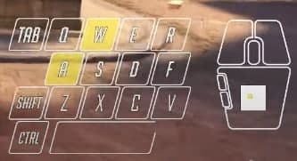

# input-overlay-electron



- OBS Input Overlay plugin clone coding
- 오버워치 방송을 보다보면 화면에 키입력을 보여주는 프로그램이 있다.
- 이런거를 한번 만들어보고 싶어서 시작

## 데모

[](https://www.youtube.com/watch?v=VVTzGOGayYA)

## 기능

- 입력키 오버레이 기능
- 항상위에 오버레이
- 오버레이 영역 마우스 클릭 무시

## 일렉트론

- 참고 ; [electron-practice](https://github.com/chinsun9/electron-practice)

## iohook

- electron 9 미만 버전을 사용해야한다고한다..
- 나는 v10.0.5 였다.
- electron을 8.5.3으로 다운그레이드하고

```js tmp.js
const nodeAbi = require('node-abi');

console.log(nodeAbi.getAbi('8.5.3', 'electron'));
console.log(nodeAbi.getAbi('12.18.3', 'node'));
```

- node-abi라는 것을 통해서 노드와 일렉트론 abi값을 구했다.
- 그리고 iohook 설치전에 package.json에서 설정을 해줘야한다.

```json package.json
 "iohook": {
    "targets": [
      "node-72",
      "electron-76"
    ],
    "platforms": [
      "win32",
      "darwin",
      "linux"
    ],
    "arches": [
      "x64",
      "ia32"
    ]
  }
```

- node-abi에서 구한 값을 targets에 넣어준다.
- targets 이외의 값은 잘 몰라서 그냥 두었다.
- 참고 ; https://wilix-team.github.io/iohook/usage.html#usage-with-electron

## 이탤릭 div border 만들기

- 참고 ; https://stackoverflow.com/questions/54320706/how-to-create-italic-box-in-css http://jsfiddle.net/tzn9jfh7/2/

```css
:root {
  --skew-value: -20deg;
}

.box-container > div {
  transform: skew(var(--skew-value));
}
```

- 이런 css는 처음본다.. ㄷㄷ

## electron window 세팅

```js index.js
mainWindow.setAlwaysOnTop(true, 'screen');
mainWindow.setIgnoreMouseEvents(true);
```

- 항상위 세팅과
- 마우스 이벤트를 무시하도록 설정이 가능하다. 진짜 오버레이처럼..!
- 참고 ; http://electron.ebookchain.org/ko-KR/api/browser-window.html
